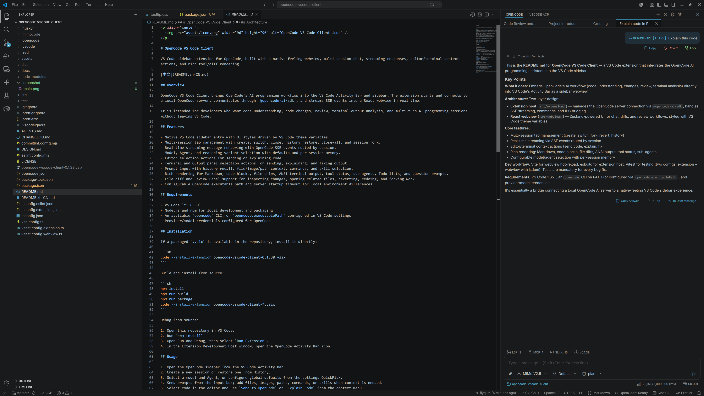

<p align="center">
  
</p>

# OpenCode VS Code Client

VS Code sidebar extension for OpenCode, built with a native-feeling webview, multi-session chat, streaming responses, editor/terminal context actions, and rich tool/diff rendering.

[中文](README.zh-CN.md)

## Overview

OpenCode VS Code Client brings OpenCode's AI programming workflow into the VS Code Activity Bar and sidebar. The extension starts and connects to a local OpenCode server, communicates through `@opencode-ai/sdk`, and streams SSE events into a React webview in real time.

It is intended for developers who want code understanding, code changes, review, terminal-output analysis, and multi-turn AI programming sessions without leaving VS Code.

## Screenshot



## Features

- Native VS Code sidebar entry with UI styles driven by VS Code theme variables.
- Multi-session tab management with create, switch, close, history restore, close-all, and session fork.
- Real-time streaming message rendering with OpenCode SSE events routed by session.
- Model, Agent, and reasoning variant selection with defaults and per-session memory.
- Editor selection actions for sending or explaining code.
- Terminal and Output panel selection actions for sending, explaining, and fixing output.
- Prompt input with history recall, file/image/path context, commands, and skill selection.
- Rich rendering for Markdown, code blocks, file chips, ANSI terminal output, tool status, sub-agents, Todo lists, and question prompts.
- File diff and Review Panel support for inspecting changes, opening related files, reverting, redoing, and forking work.
- Configurable OpenCode executable path and server startup timeout for local environment differences.

## Requirements

- VS Code `^1.65.0`
- Node.js and npm for local development and packaging
- An available `opencode` CLI, or `opencode.executablePath` configured in VS Code settings
- Provider/model credentials configured for OpenCode

## Installation

If a packaged `.vsix` is available in the repository, install it directly:

```sh
code --install-extension opencode-vscode-client-0.1.38.vsix
```

Build and install from source:

```sh
npm install
npm run build
npm run package
code --install-extension opencode-vscode-client-*.vsix
```

Debug from source:

1. Open this repository in VS Code.
2. Run `npm install`.
3. Open Run and Debug, then select `Run Extension`.
4. In the Extension Development Host window, open the OpenCode Activity Bar icon.

## Usage

1. Open the OpenCode sidebar from the VS Code Activity Bar.
2. Create a new session or restore one from History.
3. Select a model and Agent, or configure global defaults from the settings QuickPick.
4. Send prompts from the input box; add files, images, paths, commands, or skills when context is needed.
5. Select code in the editor and use `Send to OpenCode` or `Explain Code` from the context menu.
6. Select terminal or Output panel text and use `Send Selected Lines to OpenCode` or `Explain and Fix in OpenCode`.
7. For replies with file changes, open the diff/review view and fork, revert, or redo sessions as needed.

## VS Code Settings

| Setting                   | Default | Description                                                                     |
| ------------------------- | ------- | ------------------------------------------------------------------------------- |
| `opencode.model`          | `""`    | Default model in `provider/model` format.                                       |
| `opencode.agent`          | `""`    | Default Agent.                                                                  |
| `opencode.historySize`    | `50`    | Number of prompt history entries to keep, from `1` to `500`.                    |
| `opencode.serverTimeout`  | `15000` | OpenCode server startup timeout in milliseconds.                                |
| `opencode.executablePath` | `""`    | Absolute path to the `opencode` executable. Leave empty to resolve from `PATH`. |

## Development Commands

| Command                  | Description                                                     |
| ------------------------ | --------------------------------------------------------------- |
| `npm run build`          | Builds the webview first, then the extension host.              |
| `npm run dev:webview`    | Starts the Vite webview dev server for webview hot reload only. |
| `npm run test`           | Runs both extension and webview tests.                          |
| `npm run test:extension` | Runs extension host tests.                                      |
| `npm run test:webview`   | Runs webview tests.                                             |
| `npm run lint`           | Runs ESLint and TypeScript checks.                              |
| `npm run package`        | Packages a VSIX with `vsce package`.                            |

## Architecture

```text
VS Code Extension Host
  ├─ SDKClient: starts/connects OpenCode server and wraps @opencode-ai/sdk
  ├─ SessionManager: manages sessions, status, history, fork/revert/diff
  ├─ IPCBridge: routes extension <-> webview messages
  └─ Commands: editor, terminal, settings, history and session commands

React Webview
  ├─ Zustand stores: sessions, messages, prompt history and UI state
  ├─ Chat components: messages, parts, markdown, tools and permissions
  └─ Review components: file diffs and review workflow
```

Key paths:

- `src/extension/`: VS Code extension host code. Entry point: `src/extension/index.ts`.
- `src/webview/`: React + Vite webview code.
- `src/shared/`: Types and utilities shared by the extension host and webview.
- `test/` and `src/**/*.test.*`: Vitest tests and test mocks.
- `docs/SPEC.md`: Project specification and deeper module design notes.
- `DESIGN.md`: Webview UI design rules and VS Code token constraints.

## Testing

The project uses two Vitest configurations:

- Extension tests use `vitest.config.extension.ts`.
- Webview tests use `vitest.config.webview.ts`, jsdom, Testing Library, and `test/setup/webview.ts`.

Every bug fix should include a regression test in the appropriate suite that covers the exact scenario that triggered the issue.

## License

This project is licensed under the [MIT License](LICENSE).
